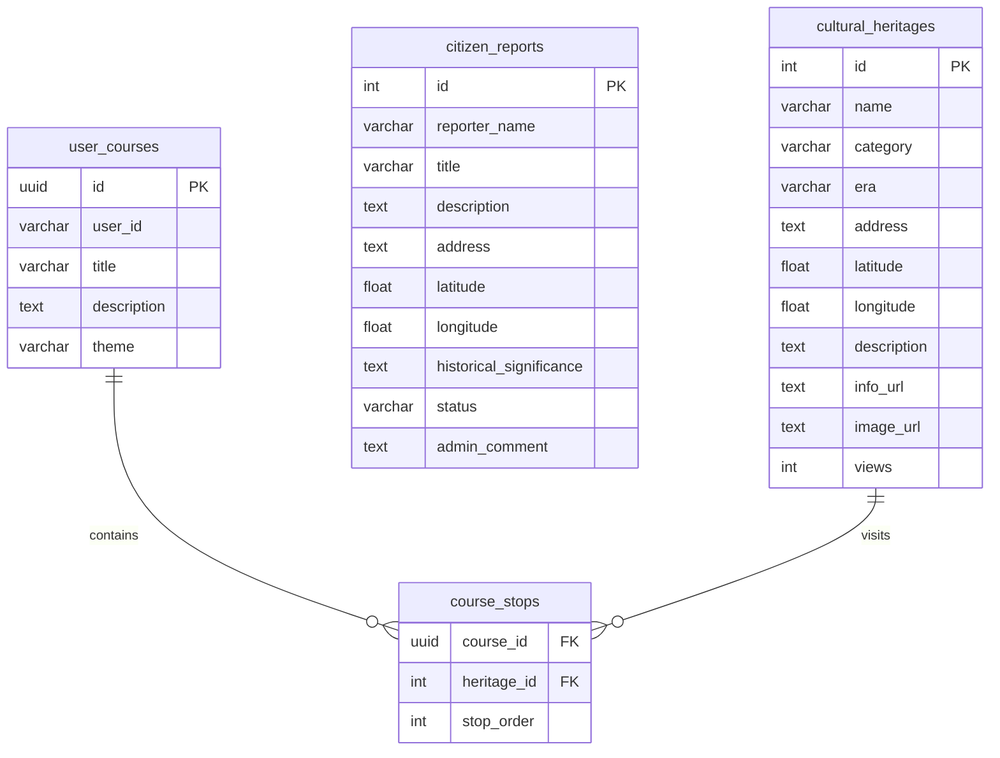

# Sejong City Cultural Heritage Service - Storage Layer

This folder houses the database design and local development simulation tools for the Sejong City Cultural Heritage Service.

## Directory Structure

```
storage/
├── supabase/
│   └── schema.sql      # Supabase (PostgreSQL) Relational Schema
├── neo4j/
│   └── schema.cypher   # Neo4j Graph Database Schema & sample queries
├── mock_db.json        # High-fidelity mock database for Sejong City heritage
├── db_helper.py        # Python helper class for DB queries and LLM context
└── README.md           # This file
```

---

## 1. Database Architecture & Design

Our service utilizes a hybrid approach:
- **Supabase/PostgreSQL (Relational)**: Handles structured transactions, citizen-submitted reports, user accounts, and master heritage metadata.
- **Neo4j (Graph)**: Manages relations between historical eras, themes, physical locations, and spatial proximity connections (crucial for pathfinding and travel course recommendations).

### Schema ERD Overview



---

## 2. Python Database Helper (`SejongDBHelper`)

For local testing and fast iteration, `db_helper.py` provides `SejongDBHelper`. It reads and writes from `mock_db.json`, simulating both relational and graph-based queries.

### Basic Usage

```python
from storage.db_helper import SejongDBHelper

# Initialize helper (loads mock_db.json automatically)
db = SejongDBHelper()

# 1. Search cultural heritage
heritages = db.search_heritage(query="은행나무", category="기념물")
for h in heritages:
    print(f"Name: {h['name']}, Address: {h['address']}")

# 2. Query adjacent sites (simulating Neo4j Graph Query)
recommendations = db.get_nearby_recommendations(heritage_id=2, limit=2)
for rec in recommendations:
    print(f"Next stop: {rec['heritage']['name']} ({rec['distance_km']} km away)")

# 3. Format context string for LLM input
llm_prompt_context = db.get_llm_context_string(heritage_id=1)
print(llm_prompt_context)
```

### Citizen Report Workflow Simulation
1. A citizen reports a potential new cultural heritage:
   ```python
   report = db.submit_citizen_report(
       reporter_name="홍길동",
       title="조치원 정수장 복합문화공간",
       description="옛 조치원 정수장 부지를 리모델링한 복합문화공간으로 문화 정원의 가치가 높음.",
       address="세종특별자치시 조치원읍 수원지길 75"
   )
   ```
2. Admin reviews and approves the report (this will automatically publish it to the master heritage database):
   ```python
   db.review_citizen_report(
       report_id=report["id"],
       status="APPROVED",
       admin_comment="지역 도시재생 가치 및 문화 향유 거점으로 훌륭하여 유형명소로 승인함."
   )
   ```
